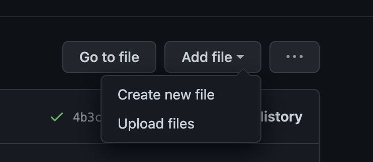

# C4DM website maintaining guide


# Introduction

This guide provides you with all the information needed to update and maintain content for the [c4dm website](https://c4dmwebsitemain.gatsbyjs.io/). Most of the tasks can be directly performed directly within the [c4dm Github repository](https://github.com/c4dm/c4dm-website). The only folder that you have to focus on is [src/content](./src/content). In this guide we explain how to update the following content from the website:

- [C4DM website maintaining guide](#c4dm-website-maintaining-guide)
- [Introduction](#introduction)
  - [Updating Patents](#updating-patents)
  - [Updating Projects](#updating-projects)
  - [Updating Publications](#updating-publications)
  - [Updating People](#updating-people)
  - [Updating News \& Events](#updating-news--events)
- [Technical Setup](#technical-setup)
- [Developing Locally](#developing-locally)
  - [With Develop](#with-develop)
  - [With Build](#with-build)


## Updating Patents
For adding a new patent or editing existing ones, go to [/src/content/research/patents/projects](./src/content/research/patents/projects) in the Github repository. 
You will find a list of .md (markdown) files, one for each patent entry. You will see that each of the files has a structure similar to the following example: 

```
---
title: "Music Collection Navigation"
begin: "22 August 2008 "
grant: "0815362.9 (UK), 09784979.8 (Europe), 13/060090 (USA)"
---
```

For adding a new patent, go to the `Add file > Create new file` option at the upper right corner. 



You can name the file as you like, but make sure it ends with `.md` and that the name is unique in the folder. 
Now fill in the content following the same format shown above, making sure you include a ``title`` entry with the progect's name, a ``begin`` entry with the date of the project and a ``grant`` entry with the corresponding patent number. If you don't know a aprticular entry like the patent number, you can add something like ``"Unknown patent number"`` or a similar text. Make sure to add quote marks for the content. 

## Updating Projects
Adding a new project works similar than for [patents](#updating-patents). To add a new project go to [/src/content/projects](./src/content/projects) in the Github repository. 
You will find a list of .md (markdown) files, one per project. The format for each project is similar to the following example:

```
---
title: "RUDIMENTS: Reflective Understanding of Digital Instruments as Musical Entanglements"
link: "https://gtr.ukri.org/projects?ref=EP%2FX023478%2F1"
author: "Prof Andrew McPherson"
begin: "2022"
end: "2027"
grant: "ERC Consolidator Grant / UKRI Research Grant EP/X023478/1"
amount: "£1,723,185"
status: "active"
tags: ["academic"]
image: "./rudiments.jpeg"
---
```

For adding a new project, similar to [patents](#updating-patents), create a new file and fill in the content following the same format shown above. In the ``author`` entry, add the PI for the project and any other involved investigators, if applies.\
For the ``status`` entry, add ``"active"`` if ther project is still in development, and add ``"complete"`` is the project has closed. This will help to organize projects when navigating. \
Feel free to add tags for your project, they must be added as an array, each element in quotes, and separated by a comma (e.g. ``tags: ["academic","AI","musical-instrument"]``).\
If you want to add an image to be displayed along the project, please upload the image to the same folder where the `.md` file is. Then, in the ``image`` entry, add the file name following the format above. \ 
**Important:** If no image is available, use the default image by adding ``"./placeholder.png"``for the ``image`` entry.

## Updating Publications
Publications are structured as `.bib` files. If you go to [/src/content/publications](./src/content/publications) in the Github repository, you will see one `.bib` file per year. For adding new entries, you can either modify an existing year file or adding a new year if needed. \

**Important:** Make sure that the `.bib` file is "clean" enough, meaning that:
- It doesn't contain empty categories, such as ``conference = {}``
- Each entry should contain a non-empty year (e.g. ``year = {2019}``)
- Remove duplicate entries. This is very likely to occur if you import .bib from QM Elements. 

For adding a new file, go to go to [/src/content/publications](./src/content/publications) and press `Add file > Upload file` in the upper right corner of the repository and upload the corresponding `.bib` file. 


## Updating People
For adding a new member of c4dm (to be displayed in the [People page](https://c4dmwebsitemain.gatsbyjs.io/people/)), go to [/src/content/people](./src/content/people) in the Github repository. 
You will find a list of .md (markdown) files, one for each member. Each file has a structure similar to the following example:

```
---
name: "Teodoro Dannemann"
url: "https://teodannemann.wordpress.com/"
acadposition: "PhD Student"
blurb: "Sabotaging, errors and other mistakes as a source of new techniques in music improvisation"
themes: ["augmi","isam"]
role: "PhD"
image: "./teodannemann.png"
---
```
The ``acadposition`` should be a very short (2-3 words) description of the position of the member. /
The ``themes`` entry corresponds to the lab(s) that the member is taking part. Current labels for labs are:

- Audio Engineering --> "audioeng"
- Augmented Instruments --> "augmi"
- Communication Acoustics --> "comma"
- Machine Listening --> "mlist"
- Music Cognition --> "mcog"
- Music Informatics --> "mir"
- Sonic Interaction Design --> "isam"
- Sound Synthesis --> "soundsynthesis"

The ``role`` entry is used to group people of the same academic position (e.g PhDs, academics, etc). Make sure that you use the exact same label so members can be correctly grouped. You can see the current tags by going to the [people page](https://c4dmwebsitemain.gatsbyjs.io/people/) and checking the tags that appear. If you add a new label to a member, you should see the corresponding tag appearing on this page. 

If you want to add an image of the member to be displayed, please upload the image to the same folder where the `.md` file is. Then, in the ``image`` entry, add the file name following the format above. \ 
**Important:** If no image is available, use the default image by adding ``"./defaultprofile.png"``for the ``image`` entry.

## Updating News & Events
For adding news and events entries, go to [/src/content/news](./src/content/news) in the Github repository. 
You will find a list of .md (markdown) files, one for each news & events entry. To create a new entry, create a new .md file, as explain in [patents section](#updating-patents). The file should start with the following format:

```
---
title: " C4DM Seminar: Axel Marmoret"
author: "Admin"
date: "2022-03-16"
image: "./placeholder.png"
tags: ["seminars", "events"]
---
```

`title` and `author` don't have any restrictions in format. 
`date` has to follow the `yyyy-mm-dd` format.\
`tags` is an array of words to group the news & events when displayed. You can add whatever tag you find useful. Just remember to be consistent and not create too many tags as it could lead to a cumbersome page display.\
If you want to add an image to be displayed for the particular entry, please upload the image to the same folder where the `.md` file is. Then, in the ``image`` entry, add the file name following the format above. \ 
**Important:** If no image is available, use the default image by adding ``"./placeholder.png"``for the ``image`` entry.


# Technical Setup

A quick technical perspective on how the website was created and how it is hosted.

The website was created with the [Gatsby](https://www.gatsbyjs.com/) framework. Gatsby is a react-based static site generator. It further uses the CSS framework [Bulma](https://bulma.io/) for styling.

The source code is hosted and built here on GitHub. Every time, changes are committed to GitHub a rebuilt is triggered on Github Pages.


# Developing Locally

## With Develop

Typically, you can run an updating server with the `gatsby develop` command

## With Build

However, there are some plugins (such as Create Redirects), which only run upon building. If you want to preview changes of these (its much slower), you can do the following:

build the site with `gatsby build`
navigate to the built site with `cd public`
run a local server using `http-server -g`
then navigate to the url provided by the CLI
