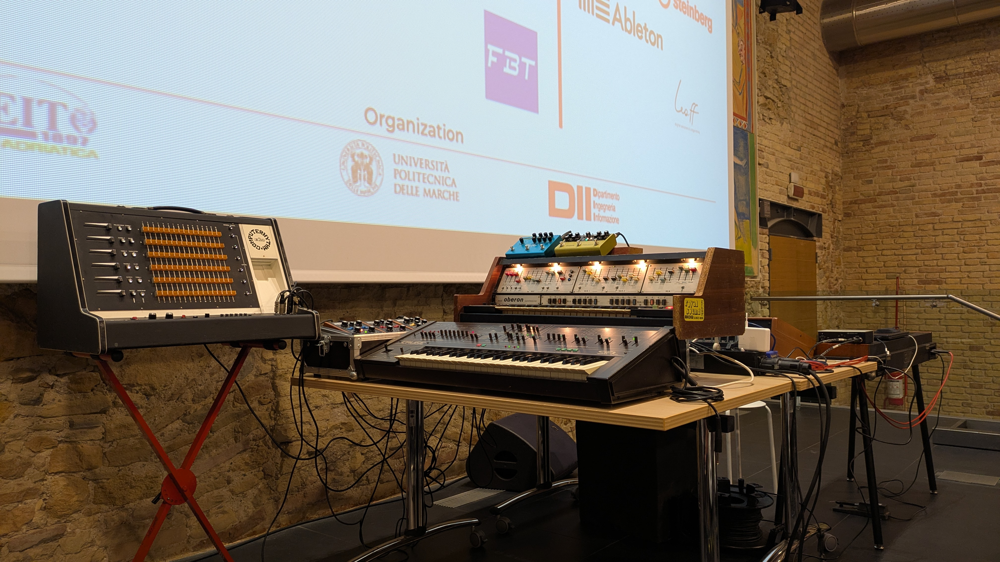

The last Digital Audio Effects (DAFx) conference was held from 2nd to 5th September 2025 at the historic Mole Vanvitelliana in Ancona, Italy. 
DAFx is a leading international conference dedicated to the exploration of digital audio effects, signal processing, and related technologies.

Day one consisted of a series of tutorials, covering topics such as non-iterative numerical simulation, filter design with logarithmic frequency resolution, to differentiable pipelines for feedback delay networks and acoustic environment editation.
The remaining days featured a rich technical programme, including oral and poster presentations, interesting demos, and keynote talks from renowned researchers in the field.
The banquet on the second day was located at the other side of city, in the beautiful setting of the MaWay restaurant, overlooking the Adriatic Sea, featuring amazing seafood and risotto dishes.
The next day concluded with an amazing electronic sound and video performance at the conference venue, featuring a selection of Italian vintage synthesisers.

This time C4DM had three technical papers accepted at DAFx 2025, focusing on the theme of **differentiable systems** in different paradigms and applications.

The first paper, titled [Fast Differentiable Modal Simulation of Non-Linear Strings, Membranes, and Plates](https://www.dafx.de/paper-archive/2025/DAFx25_paper_35.pdf), was presented by PhD student Rodrigo Diaz.
This work develop GPU-accelerated and differentiable implementations for physical modelling of musical instruments, focusing on modal synthesis of strings, membranes, and plates with non-linear effects.
The resulting implementations in JAX can be accessed [here](https://github.com/rodrigodzf/jaxdiffmodal).
This work makes differentiable simulations easy to use, effectively bridging classical modal techniques with modern automatic differentiation methods.

The second paper, titled [Differentiable Attenuation Filters for Feedback Delay Networks](https://www.dafx.de/paper-archive/2025/DAFx25_paper_54.pdf), was presented by PhD student Ilias Ibnyahya.
This work focus on designing the attenutation filters used in feedback loop of feedback delay networks (FDNs) for artificial reverberation.
Cascaded second-order sections are used and shared across all delay lines, reducing the number of parameters needed.
The proposed design is differentiable, allowing for end-to-end optimisation of the FDN parameters using gradient-based methods.
The source code is available [here](https://github.com/ilias-audio/iir_match).

The last paper, titled [DiffVox: A Differentiable Model for Capturing and Analysing Vocal Effects Distributions](https://www.dafx.de/paper-archive/2025/DAFx25_paper_9.pdf), was presented by PhD student Chin-Yun Yu.
This work introduces DiffVox, a chain of differentiable audio effects implemented in PyTorch.
DiffVox consists of a parametric equaliser, a dynamic range compressor, a ping-pong delay, and a FDN-based reverb.
The effects were implemented in a way that is fast to evaluate, differentiable, but still represents the original audio effect well.
In collaboration with Sony AI, DiffVox was optimised on hundreds of proprietary solo vocal tracks processed with various vocal effects.
The resultings presets were analysed and visualised to understand the distributions of real-world effects settings.
The source code is available [here](https://github.com/SonyResearch/diffvox).
An [interactive demo](https://huggingface.co/spaces/yoyolicoris/diffvox) on huggingface was also demonstrated on the last day of the conference.

